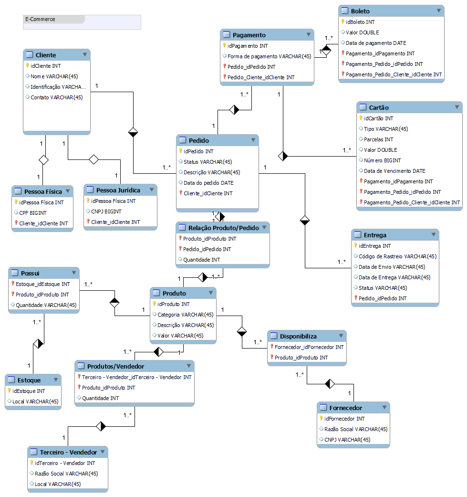

# Desafio 004 - Refinando um Projeto Conceitual de Banco de Dados – E-COMMERCE
Desafio de projeto do Bootcamp na DIO ministrado por Juliana Mascarenhas.

## Projeto Conceitual de Banco de Dados – E-COMMERCE
### Contexto
Design conceitual usando EER simulando o processo de compra de um produto em um e-commerce.
- Os clientes realizam um pedido
- O pedido cria uma ordem de pagamento e um status de entrega
- O pedido possui múltiplos produtos
- O produto é  checado no estoque, assim como o fornecedor e vendedor do mesmo.
- O produto pode ter vendedores diferentes.

### Entidades
- Cliente
  - Sendo PF ou PJ.
- Pagamento
  - Boleto ou Cartão.
-  Entrega
   -  Status e código de rastreio
-  Produto
-  Vendedor
-  Fornecedor

### Modelagem

